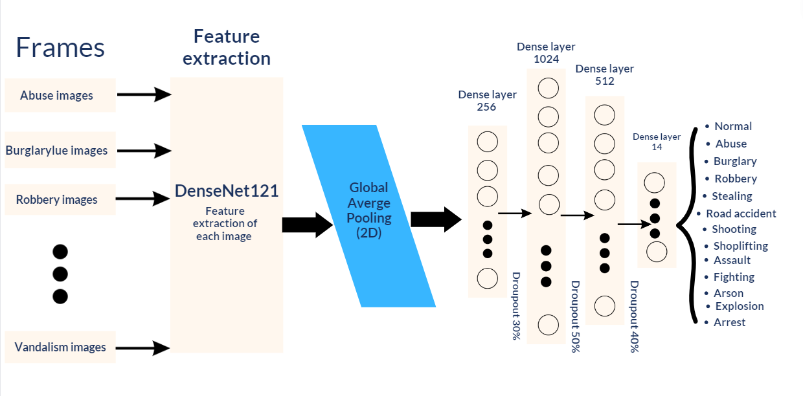

# Anomaly Detection Repository

Welcome to the Anomaly Detection repository! This repository contains code for an anomaly detection system that can be used to detect anomalies in videos. The repository is organized into two main folders:

# 1. Model

The `model` folder contains the code for the anomaly detection model. The architecture is as follows:




To train the model, you will need a dataset, which is not included in this repository. You can find a suitable dataset on Kaggle (UCF Crime dataset). Once you have the dataset, place the training data in the `Train` folder and the test data in the `Test` folder.

# 2. System

The `testing_model` folder contains the code for the anomaly detection system. This system takes input from a video source, either directly from a camera or from an existing video file. It processes the video by converting it into frames. Each frame is then passed through the trained model, `model_new_approach.h5`, for anomaly detection. If a frame is classified as non-normal, the window displaying the video or stream starts blinking in red, and an alarm is launched.

In the `testing_model` folder, you will find some sample videos. These videos can be used to test the model and observe its performance.

**Note:** Ensure that you have the necessary dependencies installed before running the code. You can check the required packages in the `requirements.txt` file and install them using the command:
```
pip install -r requirements.txt
```

Please remember to properly configure your video source and adjust any necessary settings in the code to fit your specific use case.

Feel free to explore, modify, and adapt the code in this repository to suit your needs. If you have any questions or need further assistance, don't hesitate to reach out. Happy anomaly detection!

# 2. Demo
[](https://vimeo.com/835170706)


